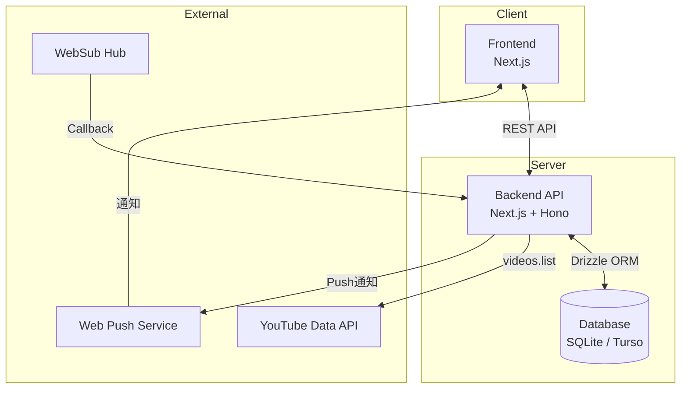
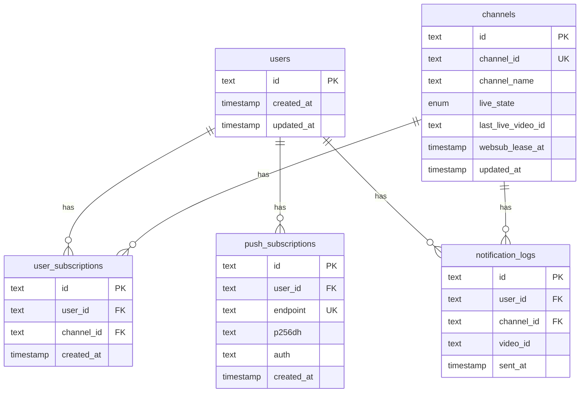
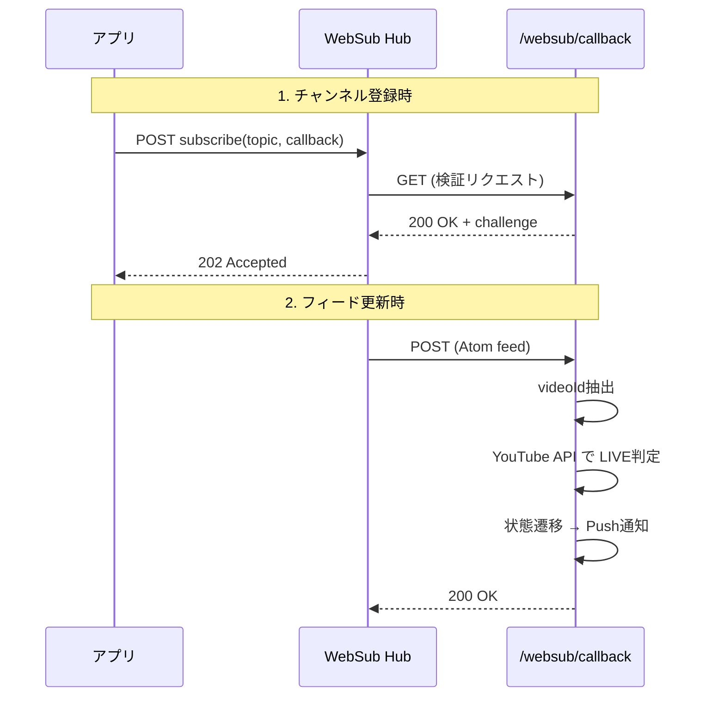
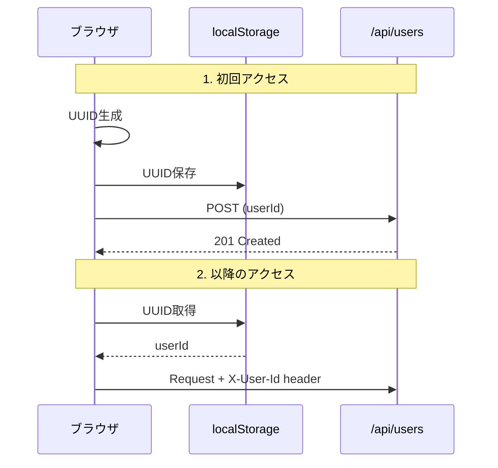

# 設計書: YouTube Live Notify MVP

## 1. システムアーキテクチャ

### 1.1 全体構成



### 1.2 技術スタック

| レイヤー       | 技術                      | 理由                                            |
| -------------- | ------------------------- | ----------------------------------------------- |
| 言語           | TypeScript                | 型安全性、JSは使用しない                        |
| パッケージ管理 | pnpm                      | 高速、ディスク効率、厳格な依存関係管理          |
| Frontend       | Next.js 16 (App Router)   | 最新安定版、SSR対応、API Routes統合             |
| Backend        | Next.js API Routes + Hono | Honoの軽量・高速なルーティング、型安全なAPI実装 |
| Database       | SQLite (Turso) + Drizzle ORM | 型安全、軽量、無料枠5GB、エッジ対応           |
| Hosting        | Vercel                    | Next.jsとの親和性、Webhookサポート              |
| Web Push       | web-push (npm)            | 標準的なWeb Push実装                            |

---

## 2. データベース設計

### 2.1 ER図



### 2.2 Drizzle ORMスキーマ

```typescript
// src/db/schema.ts
import { sqliteTable, text, integer, unique } from 'drizzle-orm/sqlite-core';
import { createId } from '@paralleldrive/cuid2';
import { sql } from 'drizzle-orm';

// Users
export const users = sqliteTable('users', {
  id: text('id')
    .primaryKey()
    .$defaultFn(() => createId()),
  createdAt: integer('created_at', { mode: 'timestamp' })
    .notNull()
    .default(sql`(unixepoch())`),
  updatedAt: integer('updated_at', { mode: 'timestamp' })
    .notNull()
    .default(sql`(unixepoch())`),
});

// Channels
export const channels = sqliteTable('channels', {
  id: text('id')
    .primaryKey()
    .$defaultFn(() => createId()),
  channelId: text('channel_id').unique().notNull(),
  channelName: text('channel_name'),
  liveState: text('live_state', { enum: ['OFFLINE', 'LIVE'] })
    .notNull()
    .default('OFFLINE'),
  lastLiveVideoId: text('last_live_video_id'),
  websubLeaseAt: integer('websub_lease_at', { mode: 'timestamp' }),
  updatedAt: integer('updated_at', { mode: 'timestamp' })
    .notNull()
    .default(sql`(unixepoch())`),
});

// User Subscriptions
export const userSubscriptions = sqliteTable(
  'user_subscriptions',
  {
    id: text('id')
      .primaryKey()
      .$defaultFn(() => createId()),
    userId: text('user_id')
      .notNull()
      .references(() => users.id, { onDelete: 'cascade' }),
    channelId: text('channel_id')
      .notNull()
      .references(() => channels.id, { onDelete: 'cascade' }),
    createdAt: integer('created_at', { mode: 'timestamp' })
      .notNull()
      .default(sql`(unixepoch())`),
  },
  (table) => ({
    userChannelUnique: unique().on(table.userId, table.channelId),
  }),
);

// Push Subscriptions
export const pushSubscriptions = sqliteTable('push_subscriptions', {
  id: text('id')
    .primaryKey()
    .$defaultFn(() => createId()),
  userId: text('user_id')
    .notNull()
    .references(() => users.id, { onDelete: 'cascade' }),
  endpoint: text('endpoint').unique().notNull(),
  p256dh: text('p256dh').notNull(),
  auth: text('auth').notNull(),
  createdAt: integer('created_at', { mode: 'timestamp' })
    .notNull()
    .default(sql`(unixepoch())`),
});

// Notification Logs
export const notificationLogs = sqliteTable('notification_logs', {
  id: text('id')
    .primaryKey()
    .$defaultFn(() => createId()),
  userId: text('user_id')
    .notNull()
    .references(() => users.id, { onDelete: 'cascade' }),
  channelId: text('channel_id')
    .notNull()
    .references(() => channels.id, { onDelete: 'cascade' }),
  videoId: text('video_id').notNull(),
  sentAt: integer('sent_at', { mode: 'timestamp' })
    .notNull()
    .default(sql`(unixepoch())`),
});
```

### 2.3 Drizzle設定

```typescript
// drizzle.config.ts
import { defineConfig } from 'drizzle-kit';

export default defineConfig({
  schema: './src/db/schema.ts',
  out: './drizzle',
  dialect: 'turso',
  dbCredentials: {
    url: process.env.TURSO_DATABASE_URL!,
    authToken: process.env.TURSO_AUTH_TOKEN,
  },
});
```

```typescript
// src/db/index.ts
import { drizzle } from 'drizzle-orm/libsql';
import { createClient } from '@libsql/client';
import * as schema from './schema';

const client = createClient({
  url: process.env.TURSO_DATABASE_URL!,
  authToken: process.env.TURSO_AUTH_TOKEN,
});

export const db = drizzle(client, { schema });
```

---

## 3. API設計

### 3.0 Hono統合

Next.js API RoutesでHonoを使用してAPIを実装する。

```typescript
// src/app/api/[[...route]]/route.ts
import { Hono } from 'hono';
import { handle } from 'hono/vercel';
import { channelsApp } from '@/api/channels';
import { pushApp } from '@/api/push';
import { notificationsApp } from '@/api/notifications';
import { websubApp } from '@/api/websub';

const app = new Hono().basePath('/api');

// ルートをマウント
app.route('/channels', channelsApp);
app.route('/push', pushApp);
app.route('/notifications', notificationsApp);
app.route('/websub', websubApp);

export const GET = handle(app);
export const POST = handle(app);
export const DELETE = handle(app);
```

```typescript
// src/api/channels.ts
import { Hono } from 'hono';
import { zValidator } from '@hono/zod-validator';
import { z } from 'zod';

const channelSchema = z.object({
  channelId: z.string().regex(/^UC[\w-]{22}$/),
});

export const channelsApp = new Hono()
  .get('/', async (c) => {
    // チャンネル一覧取得
  })
  .post('/', zValidator('json', channelSchema), async (c) => {
    // チャンネル登録
  })
  .delete('/:id', async (c) => {
    // チャンネル削除
  });
```

### 3.1 エンドポイント一覧

| Method | Path                  | 説明                       |
| ------ | --------------------- | -------------------------- |
| GET    | `/api/channels`       | 登録済みチャンネル一覧取得 |
| POST   | `/api/channels`       | チャンネル登録             |
| DELETE | `/api/channels/[id]`  | チャンネル削除             |
| POST   | `/api/push/subscribe` | Push購読登録               |
| DELETE | `/api/push/subscribe` | Push購読解除               |
| GET    | `/api/notifications`  | 通知履歴取得               |
| GET    | `/websub/callback`    | WebSub検証                 |
| POST   | `/websub/callback`    | WebSubフィード受信         |

### 3.2 API詳細

#### POST /api/channels

チャンネルを登録する。

**Request:**

```json
{
  "channelId": "UC..."
}
```

**Response (201):**

```json
{
  "id": "cuid...",
  "channelId": "UC...",
  "channelName": "Channel Name",
  "createdAt": "2024-01-01T00:00:00Z"
}
```

**Errors:**

- 400: channelIdが不正
- 409: 既に登録済み
- 429: 登録上限（10件）超過

#### POST /api/push/subscribe

Web Push購読を登録する。

**Request:**

```json
{
  "endpoint": "https://...",
  "keys": {
    "p256dh": "...",
    "auth": "..."
  }
}
```

#### POST /websub/callback

WebSubからのフィード更新を受信。

**Processing:**

1. XML解析してvideoIdを抽出
2. YouTube Data APIでライブ状態確認
3. 状態遷移ロジック実行
4. 必要に応じてPush通知送信

---

## 4. フロントエンド設計

### 4.1 ページ構成

```
/
├── page.tsx          # メイン設定ページ
├── layout.tsx        # 共通レイアウト
└── components/
    ├── ChannelList.tsx      # チャンネル一覧
    ├── ChannelForm.tsx      # チャンネル登録フォーム
    ├── PushStatus.tsx       # Push通知状態
    └── NotificationLog.tsx  # 通知履歴
```

### 4.2 状態管理

- React Server Components + Client Componentsの使い分け
- Push購読状態: ブラウザAPI (`Notification.permission`)
- チャンネル一覧: Server Component でのfetch

### 4.3 UI構成

```
┌────────────────────────────────────────┐
│  YouTube Live Notify                   │
├────────────────────────────────────────┤
│  🔔 Push通知: ON                       │
│  [通知を許可する] ボタン              │
├────────────────────────────────────────┤
│  チャンネル登録 (3/10)                 │
│  ┌──────────────────────────┐ [登録]  │
│  │ channelId を入力        │          │
│  └──────────────────────────┘          │
├────────────────────────────────────────┤
│  登録済みチャンネル                    │
│  ┌────────────────────────────────┐   │
│  │ Channel A            [削除]   │   │
│  │ Channel B            [削除]   │   │
│  │ Channel C            [削除]   │   │
│  └────────────────────────────────┘   │
├────────────────────────────────────────┤
│  最近の通知                            │
│  • Channel A が配信を開始 (1時間前)    │
│  • Channel B が配信を開始 (昨日)       │
└────────────────────────────────────────┘
```

---

## 5. WebSub連携設計

### 5.1 購読フロー



### 5.2 WebSub Hub URL

```
https://pubsubhubbub.appspot.com/
```

### 5.3 Topic URL（YouTubeチャンネルフィード）

```
https://www.youtube.com/xml/feeds/videos.xml?channel_id={channelId}
```

### 5.4 購読リクエスト

```
POST https://pubsubhubbub.appspot.com/subscribe
Content-Type: application/x-www-form-urlencoded

hub.callback=https://{domain}/websub/callback
hub.topic=https://www.youtube.com/xml/feeds/videos.xml?channel_id={channelId}
hub.mode=subscribe
hub.lease_seconds=432000  # 5日間
```

---

## 6. YouTube Data API連携

### 6.1 ライブ判定ロジック

```typescript
async function isLive(videoId: string): Promise<boolean> {
  const response = await youtube.videos.list({
    part: ['liveStreamingDetails'],
    id: [videoId],
  });

  const video = response.data.items?.[0];
  if (!video?.liveStreamingDetails) return false;

  const { actualStartTime, actualEndTime } = video.liveStreamingDetails;

  // 開始済み かつ 終了していない = LIVE
  return !!actualStartTime && !actualEndTime;
}
```

### 6.2 Quota考慮

- `videos.list`: 1リクエスト = 1 Quota
- 日次上限: 10,000 Quota（デフォルト）
- WebSub経由のため、ポーリング不要でQuota節約

---

## 7. Web Push設計

### 7.1 VAPID鍵

- 環境変数で管理: `VAPID_PUBLIC_KEY`, `VAPID_PRIVATE_KEY`
- 生成: `npx web-push generate-vapid-keys`

### 7.2 通知ペイロード

```typescript
const payload = JSON.stringify({
  title: `配信開始: ${channelName}`,
  body: 'YouTubeでライブが始まりました',
  icon: '/icon-192.png',
  data: {
    url: `https://www.youtube.com/watch?v=${videoId}`,
  },
});
```

### 7.3 Service Worker

```typescript
// public/sw.ts (ビルド時にsw.jsへコンパイル)
/// <reference lib="webworker" />
declare const self: ServiceWorkerGlobalScope;

interface PushPayload {
  title: string;
  body: string;
  icon: string;
  data: {
    url: string;
  };
}

self.addEventListener('push', (event: PushEvent) => {
  const data: PushPayload = event.data?.json();
  event.waitUntil(
    self.registration.showNotification(data.title, {
      body: data.body,
      icon: data.icon,
      data: data.data,
    }),
  );
});

self.addEventListener('notificationclick', (event: NotificationEvent) => {
  event.notification.close();
  event.waitUntil(clients.openWindow(event.notification.data.url));
});
```

---

## 8. ユーザー識別設計（MVP簡略版）

### 8.1 方針

- MVPではOAuth未実装
- ブラウザごとにUUIDを生成してlocalStorageに保存
- サーバー側ではこのUUIDをuser_idとして扱う

### 8.2 フロー



---

## 9. 環境変数

```env
# Database (Turso)
TURSO_DATABASE_URL="libsql://your-db-name.turso.io"
TURSO_AUTH_TOKEN="your-auth-token"

# YouTube Data API
YOUTUBE_API_KEY="..."

# Web Push VAPID
VAPID_PUBLIC_KEY="..."
VAPID_PRIVATE_KEY="..."
VAPID_SUBJECT="mailto:admin@example.com"

# App
NEXT_PUBLIC_APP_URL="https://..."
```

---

## 10. エラーハンドリング

| シナリオ                | 対応                       |
| ----------------------- | -------------------------- |
| YouTube API エラー      | ログ記録、状態更新スキップ |
| Push送信失敗 (410 Gone) | 該当PushSubscription削除   |
| WebSub検証失敗          | ログ記録、リトライ対象     |
| channelId無効           | ユーザーにエラー表示       |

---

## 11. セキュリティ考慮

- WebSubコールバックのHMAC検証（将来実装）
- CORS設定（同一オリジンのみ）
- Rate Limiting（登録API）
- 入力値バリデーション（channelId形式）
