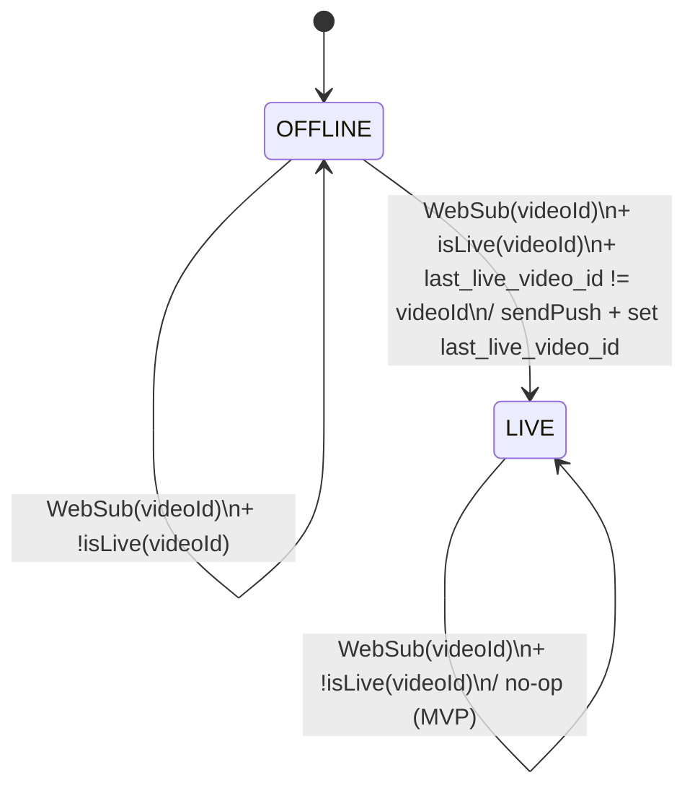
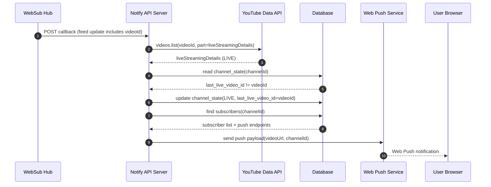

# YouTube Live Notify MVP Spec (A) - Minimal

## 0. Purpose

フォローした YouTube チャンネルが **LIVE 開始**したことを検知し、ユーザーへ **Web Push 通知**で知らせる。

- MVPの価値：**開始に気づける**
- MVPの非対象：視聴中UI / 予定通知 / モバイルPush / OAuthログイン

---

## 1. Glossary

- Channel: YouTubeのチャンネル（channelId）
- Live Video: LIVE配信の動画（videoId）
- WebSub: YouTubeフィード更新のプッシュ通知（hub->callback）
- Push: ブラウザの Web Push 通知

---

## 2. State Model

### 2.1 Channel State (system-owned)

システムがチャンネルごとに保持する最小状態。

| key                | type         | meaning                                              |
| ------------------ | ------------ | ---------------------------------------------------- |
| channel_id         | string       | YouTube channelId                                    |
| live_state         | enum         | `OFFLINE` or `LIVE`                                  |
| last_live_video_id | string\|null | 最後にLIVEと判定した videoId（重複通知防止の主キー） |
| updated_at         | datetime     | 更新時刻                                             |

> MVP方針：`OFFLINE` への復帰は **必須ではない**（復帰がなくても次回配信は videoId が変わるため通知できる）。
> ただし将来的には「LIVE継続確認ジョブ」で復帰させる余地あり。

### 2.2 User Subscription (user-owned)

ユーザーがフォローするチャンネルと通知先。

| key        | type     | meaning   |
| ---------- | -------- | --------- |
| user_id    | string   | UUID      |
| channel_id | string   | channelId |
| created_at | datetime | 登録時刻  |

Push endpoint（Web Push購読情報）は別管理。

---

## 3. State Transition Table (Channel)

### 3.1 判定ルール（LIVE確定）

WebSubで受け取った `videoId` に対して YouTube Data API `videos.list(part=liveStreamingDetails)` を実行し、
`liveStreamingDetails` が存在し、かつ「配信中」を示す情報が取れる場合に LIVE と判定する。

> 実際のフィールド条件（例：actualStartTimeの有無など）は、Data APIドキュメント確認後に確定する。
> MVPでは「YouTube APIが返す liveStreamingDetails の存在」を一次条件にし、誤通知を防ぐ。

### 3.2 遷移表（通知条件を含む）

| current (live_state) | input           | guard                                                      | next    | side effects                                                     |
| -------------------- | --------------- | ---------------------------------------------------------- | ------- | ---------------------------------------------------------------- |
| OFFLINE              | WebSub(videoId) | `isLive(videoId)=true` AND `last_live_video_id != videoId` | LIVE    | ① push通知送信 ② last_live_video_id=videoId ③ updated_at更新     |
| OFFLINE              | WebSub(videoId) | `isLive(videoId)=false`                                    | OFFLINE | updated_at更新（任意）                                           |
| LIVE                 | WebSub(videoId) | `isLive(videoId)=true` AND `last_live_video_id == videoId` | LIVE    | 何もしない（重複排除）                                           |
| LIVE                 | WebSub(videoId) | `isLive(videoId)=true` AND `last_live_video_id != videoId` | LIVE    | ① push通知送信 ② last_live_video_id=videoId（枠切替/再開の吸収） |
| LIVE                 | WebSub(videoId) | `isLive(videoId)=false`                                    | LIVE    | MVPでは原則何もしない（復帰ジョブ未実装のため）                  |

---

## 4. Mermaid Diagrams

### 4.1 Channel State Machine

### 4.2 Sequence (Happy Path: Live Start)

## 5. External Interfaces (I/F)

### 5.1 WebSub (Inbound)

目的：チャンネルの更新をプッシュで受ける。
• Inbound endpoint: POST /websub/callback
• Verification endpoint: GET /websub/callback（サブスク時の検証リクエスト）

#### Inputs (minimum)

- channelId（購読トピックから紐付け）
- videoId（フィードから抽出）

#### Processing

1. videoId抽出
1. isLive(videoId) 判定（YouTube Data API）
1. state遷移表に従い push通知

#### Expected behavior

同じ videoId が複数回来ても重複通知しない（dedupe）

### 5.2 YouTube Data API (Outbound)

目的：videoId がLIVEかどうか確定する。

- API: videos.list
- Required part: liveStreamingDetails（＋必要なら snippet など）
- Input: videoId
- Output: live判定に必要なフィールド

#### MVP constraints

search.list は使用しない（Quota・精度の揺れを避ける）

### 5.3 Web Push (Outbound)

目的：ユーザーのブラウザへ通知を送る。

- Payload (minimum):
  - title: 配信開始: {channelId}
  - body: YouTubeでライブが始まりました
  - url: https://www.youtube.com/watch?v={videoId}

#### Click behavior

通知クリックで url を開く（YouTubeへ誘導）

## 6. Minimal UI Requirements (for MVP)

### 6.1 Settings Page

- Push通知の許可状態表示（ON/OFF）
- channelId の登録/削除
- 最新通知ログ（任意だが推奨）

## 7. Decisions (MVP fixed)

- Notification target: Web Push (desktop browsers)
- Follow input: channelId manual entry
- Follow limit: 10 channels / user (initial)
- Dedupe key: last_live_video_id
- Offline recovery: not required in MVP (may be added later)
